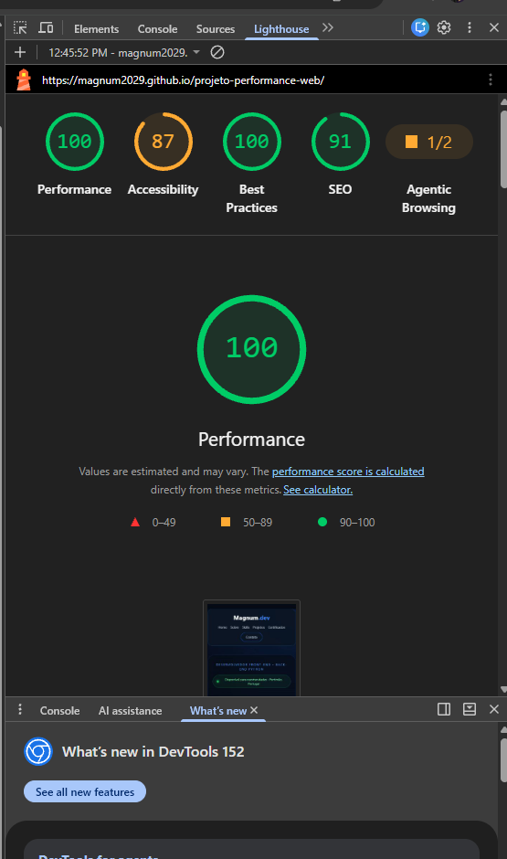
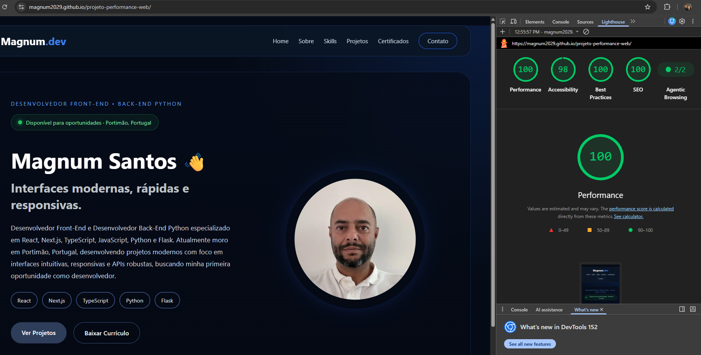

# Projeto de Performance Web

Exercício prático de análise e otimização de performance realizado sobre uma cópia independente do meu portfólio profissional. O projeto foi desenvolvido com React, TypeScript e Vite.

## Objetivo

Identificar gargalos com o Lighthouse, aplicar otimizações mensuráveis e comparar os resultados antes e depois das alterações.

## Tecnologias

- React
- TypeScript
- Vite
- CSS
- React Router
- Lighthouse

## Análise inicial

A primeira análise foi realizada no modo Mobile do Lighthouse, antes das otimizações.

| Categoria | Antes | Depois |
|---|---:|---:|
| Performance | 100 | 100 |
| Acessibilidade | 87 | 98 |
| Boas Práticas | 100 | 100 |
| SEO | 91 | 100 |



## Gargalos identificados

- Imagens em PNG e JPEG maiores do que o necessário.
- Imagem de perfil com 1152 × 1536 pixels e aproximadamente 508 KB.
- Miniaturas dos certificados somando aproximadamente 1 MB.
- Imagens sem dimensões explícitas, favorecendo mudanças de layout.
- Imagens fora da primeira tela sem carregamento adiado.
- Todas as páginas incluídas no pacote JavaScript inicial.
- Links com ícones sem nomes acessíveis.
- HTML com parágrafos aninhados incorretamente.
- Ausência de descrição da página e idioma configurado incorretamente.
- Componentes, estilos e imagens antigas sem utilização.

## Melhorias aplicadas

- Conversão das imagens de PNG/JPEG para WebP.
- Redimensionamento das imagens para as dimensões realmente necessárias.
- Redução dos recursos de imagem otimizados de aproximadamente 1,75 MB para 224 KB.
- Uso de `loading="lazy"` nas imagens de projetos, certificados e conteúdo secundário.
- Uso de `decoding="async"`, `width` e `height` para melhorar estabilidade visual.
- Priorização da imagem principal com `fetchPriority="high"`.
- Divisão do código por rota com `React.lazy` e `Suspense`.
- Minificação automática de HTML, CSS e JavaScript durante o build de produção do Vite.
- Remoção de componentes, estilos e imagens não utilizados.
- Correção da estrutura semântica do HTML.
- Inclusão de nomes acessíveis nos links com ícones.
- Inclusão de descrição, idioma e cor de tema nos metadados.
- Correção dos links internos para o caminho do GitHub Pages.

## Impacto das melhorias

A maior redução ocorreu nas imagens. A conversão para WebP e o redimensionamento diminuíram em cerca de 87% o peso dos recursos visuais otimizados. O carregamento adiado evita transferir imagens que ainda não estão visíveis. A divisão do JavaScript por rota também reduz o código necessário na primeira visita.

## Relatório final

A reanálise foi realizada no Lighthouse com as mesmas configurações do teste inicial. A Performance e as Boas Práticas mantiveram a pontuação máxima. A Acessibilidade aumentou 11 pontos, passando de 87 para 98, e o SEO aumentou 9 pontos, passando de 91 para 100.



## Comparativo e conclusão

- **Performance:** permaneceu em 100, mesmo com a redução adicional dos recursos transferidos.
- **Acessibilidade:** aumentou de 87 para 98 após correções semânticas e inclusão de nomes acessíveis nos links.
- **Boas Práticas:** permaneceu em 100.
- **SEO:** aumentou de 91 para 100 após a definição correta do idioma, título e descrição da página.

As alterações de maior impacto foram a conversão e o redimensionamento das imagens, a divisão do JavaScript por rota, a remoção de código não utilizado e as correções de acessibilidade e metadados. O resultado final apresenta carregamento mais leve, estrutura mais organizada e melhores condições de navegação e indexação.

## Como executar

```bash
npm ci
npm run dev
```

Para gerar os arquivos minificados de produção:

```bash
npm run build
```

## Autor

**Magnum de Oliveira Santos**

- [GitHub](https://github.com/Magnum2029)
- [LinkedIn](https://linkedin.com/in/magnum-de-oliveira-santos-b138041a1)
